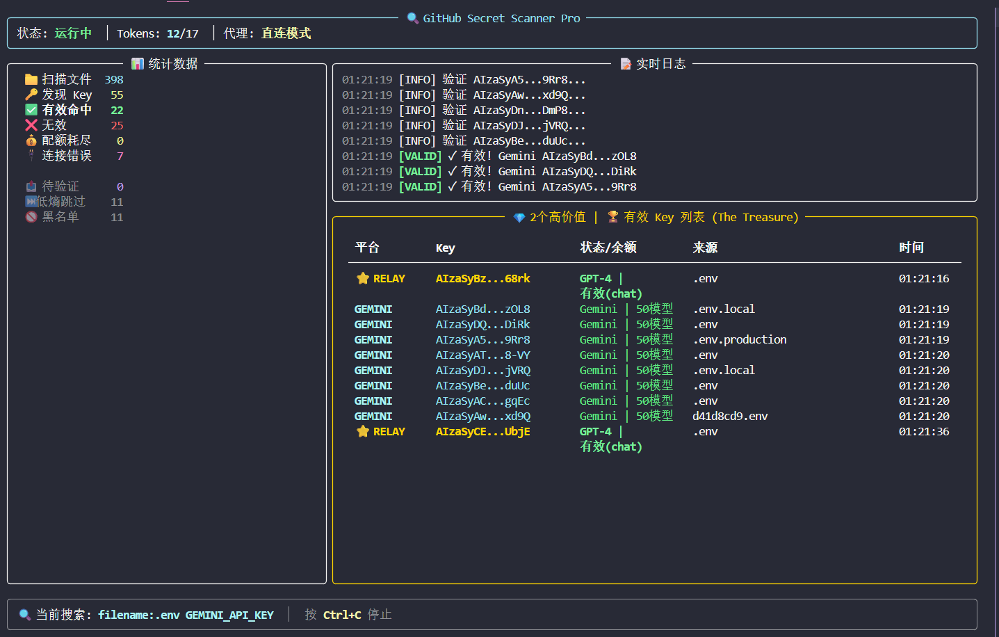
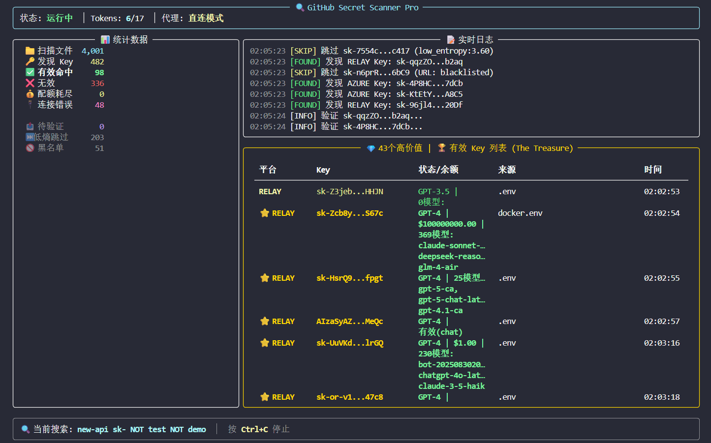

# GitHub Secret Scanner

```
User: coff0xc (uid=1000)
Type: Red Team Tool / Security Research
Target: Leaked API Keys on GitHub (OpenAI, Claude, Gemini, Azure)
```



---

## What is this?

扫 GitHub 上泄露的 API Key。

支持 OpenAI / Anthropic Claude / Google Gemini / Azure OpenAI，自动验证有效性，探测 GPT-4 权限和账户余额。

Producer-Consumer 架构，asyncio + aiohttp 异步并发，Rich TUI 实时仪表盘。

**本仓库为公开精简版。完整版私有，需要请联系 Coff0xc@protonmail.com**

---

## Screenshot

### TUI 主界面


实时显示：
- 扫描文件数 / 发现 Key 数 / 有效命中数
- 当前搜索关键词 / Token 轮换状态
- 有效 Key 列表（高价值 Key 金色高亮）
- 实时日志流

### 导出统计

```
$ python main.py --stats

┌──────────────────────────────────────┐
│            📊 数据库统计              │
├──────────────────────────────────────┤
│ 总 Key 数                        142 │
│                                      │
│ ✓ 有效                            23 │
│ 💰 配额耗尽                        31 │
│ ✗ 无效                            76 │
│ 🔌 连接错误                        12 │
│                                      │
│ 平台分布                             │
│   openai                          89 │
│   anthropic                       28 │
│   gemini                          15 │
│   azure                           10 │
└──────────────────────────────────────┘
```

---

## Features

| 功能 | 说明 |
|------|------|
| **多平台验证** | OpenAI (sk-xxx / sk-proj-xxx), Anthropic (sk-ant-xxx), Gemini (AIza-xxx), Azure |
| **GPT-4 探测** | 自动检测 Key 是否有 GPT-4/GPT-4o 权限 |
| **余额探测** | 中转站余额检测，响应头 RPM 分析 |
| **熵值过滤** | Shannon Entropy >= 3.8，过滤 `sk-test-123` 这类假 Key |
| **黑名单过滤** | 跳过 `/test/`, `/examples/`, `localhost`, `ngrok.io` 等垃圾 |
| **SHA 去重** | Git Blob SHA 级别去重，跨仓库不重复扫描同一文件 |
| **断路器保护** | 域名级熔断，官方 API 域名白名单永不熔断 |
| **持久化存储** | SQLite 双表存储，支持断点续传 |

---

## Quick Start

### 环境要求

- Python >= 3.9
- 代理（国内必需）

### 安装

```bash
git clone https://github.com/Coff0xc/Github-API-scan.git
cd Github-API-scan
pip install -r requirements.txt
```

### 配置 GitHub Token

GitHub Search API 有速率限制。未认证 10次/分钟，认证后 30次/分钟。

多 Token 轮换可以提高效率：

```bash
# Windows
set GITHUB_TOKENS=ghp_xxxx,ghp_yyyy,ghp_zzzz

# Linux/Mac
export GITHUB_TOKENS=ghp_xxxx,ghp_yyyy,ghp_zzzz
```

Token 获取：GitHub Settings → Developer settings → Personal access tokens → Generate new token (classic)

不需要任何权限，空权限即可用于 Search API。

### 配置代理

三种方式任选：

```bash
# 方式1: 环境变量
set PROXY_URL=http://127.0.0.1:7890

# 方式2: 命令行参数
python main.py --proxy http://127.0.0.1:7890

# 方式3: 修改 config.py
proxy_url: str = "http://127.0.0.1:7890"
```

### 运行

```bash
# 启动扫描（TUI 模式）
python main.py

# 指定代理
python main.py --proxy http://127.0.0.1:7890

# 指定数据库路径
python main.py --db my_keys.db
```

按 `Ctrl+C` 停止扫描。

---

## Export & Query

### 导出有效 Key

```bash
# 导出到文本文件
python main.py --export output.txt

# 导出到 CSV（含详细元数据）
python main.py --export-csv results.csv

# 仅导出特定状态
python main.py --export output.txt --status valid
python main.py --export output.txt --status quota_exceeded
```

### 查看统计

```bash
python main.py --stats
```

### 数据库交互查询

```bash
python view_db.py
```

进入交互模式，可以执行任意 SQL：

```sql
SELECT * FROM leaked_keys WHERE status = 'valid';
SELECT * FROM leaked_keys WHERE is_high_value = 1;
SELECT platform, COUNT(*) FROM leaked_keys GROUP BY platform;
```

---

## Project Structure

```
Github-API-scan/
├── main.py          # 入口，Producer-Consumer 协调器
├── scanner.py       # Producer: GitHub Search + 异步下载 + 过滤
├── validator.py     # Consumer: 异步验证 + GPT-4探测 + 余额检测
├── config.py        # 配置中心（正则、Dorks、断路器参数）
├── database.py      # SQLite 封装，双表去重
├── ui.py            # Rich TUI 仪表盘
├── check_db.py      # 数据库快速检查
├── view_db.py       # 数据库交互查询
└── requirements.txt
```

### 核心流程

```
┌─────────────┐     Queue      ┌─────────────┐
│   Scanner   │ ────────────▶  │  Validator  │
│  (Producer) │   ScanResult   │  (Consumer) │
└─────────────┘                └─────────────┘
      │                              │
      ▼                              ▼
 GitHub Search API            OpenAI/Claude/Gemini API
      │                              │
      ▼                              ▼
 Async Download               Async Validation
      │                              │
      ▼                              ▼
 Entropy Filter               GPT-4 Probe
 Blacklist Filter             Balance Probe
 SHA Dedup                    RPM Analysis
      │                              │
      └──────────────┬───────────────┘
                     ▼
               SQLite Database
              (leaked_keys + scanned_blobs)
```

---

## Configuration

### 搜索关键词 (Dorks)

编辑 `config.py` 中的 `search_keywords`：

```python
search_keywords: List[str] = field(default_factory=lambda: [
    'filename:.env OPENAI_API_KEY',
    'filename:.env GEMINI_API_KEY',
    'filename:.env anthropic_api_key',
    'sk-proj- language:python',
    'openai.azure.com api-key',
    # 添加你自己的 Dorks...
])
```

公开版仅含 5 条示例。完整版包含 20+ 条高精度狙击规则。

### 并发参数

| 参数 | 位置 | 公开版默认值 |
|------|------|-------------|
| 下载并发 | `scanner.py` → `ASYNC_DOWNLOAD_CONCURRENCY` | 20 |
| 验证并发 | `validator.py` → `MAX_CONCURRENCY` | 40 |
| 验证线程 | `main.py` → `num_workers` | 2 |
| 请求超时 | `config.py` → `request_timeout` | 12s |

需要更高强度扫描可自行调整，或联系获取完整版。

### 断路器参数

```python
CIRCUIT_BREAKER_FAILURE_THRESHOLD = 5   # 连续失败次数触发熔断
CIRCUIT_BREAKER_RECOVERY_TIMEOUT = 60   # 熔断恢复时间（秒）
CIRCUIT_BREAKER_HALF_OPEN_REQUESTS = 3  # 半开状态试探请求数
```

官方 API 域名（api.openai.com, api.anthropic.com 等）在白名单中，永不熔断。

---

## Database Schema

### leaked_keys 表

| 字段 | 类型 | 说明 |
|------|------|------|
| id | INTEGER | 主键 |
| platform | TEXT | openai / anthropic / gemini / azure / relay |
| api_key | TEXT | API Key（唯一索引） |
| base_url | TEXT | 绑定的 API 地址 |
| status | TEXT | pending / valid / invalid / quota_exceeded / connection_error |
| balance | TEXT | 余额/模型信息 |
| source_url | TEXT | GitHub 来源链接 |
| model_tier | TEXT | GPT-4 / GPT-3.5 / Claude-3 / Gemini-Pro |
| rpm | INTEGER | Rate Per Minute |
| is_high_value | BOOLEAN | 高价值标记 |
| found_time | DATETIME | 发现时间 |
| verified_time | DATETIME | 验证时间 |

### scanned_blobs 表

| 字段 | 类型 | 说明 |
|------|------|------|
| file_sha | TEXT | Git Blob SHA（主键） |
| scan_time | DATETIME | 扫描时间 |

用于跨仓库去重，相同内容的文件只扫描一次。

---

## Disclaimer

本项目仅用于安全研究和授权测试。

严禁用于非法扫描或利用他人凭证。使用者自行承担法律责任。

---

## Contact

- Email: Coff0xc@protonmail.com
- GitHub: [@Coff0xc](https://github.com/Coff0xc)
- Blog：[@Coff0xc](https://coff0xc.github.io)
---

## License

MIT
