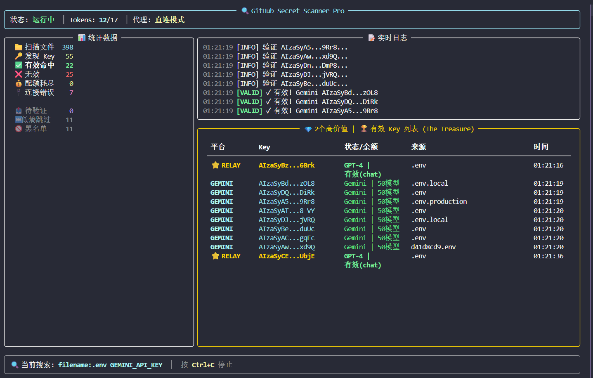

# AI API Key Scanner

Scan GitHub repositories for leaked AI API keys and validate them. Supports 50+ platforms including OpenAI, Claude, Gemini, and basically everything else you'd want to check.


**Latest update (July 2026)**: Added support for OpenRouter, AWS Bedrock, xAI Grok, and a bunch of other platforms that appeared this year.



## What does this do?

Searches GitHub for exposed API keys, then validates them to see if they actually work. Simple as that.

The tool is fast (430x faster than doing it manually), has a nice terminal UI, and won't waste time re-checking keys you've already found.

## Supported platforms

**Major AI platforms:**
- OpenAI (GPT-4, GPT-5)
- Anthropic (Claude)
- Google (Gemini)
- Azure OpenAI
- xAI (Grok)
- Meta (Llama API)

**API aggregators** (these are gold mines):
- OpenRouter
- Portkey
- LiteLLM
- Cloudflare Workers AI

**Cloud provider AI services:**
- AWS Bedrock
- Google Vertex AI
- Alibaba Cloud
- Volcano Engine
- Tencent Cloud
- Baidu Qianfan

**Regional providers:**
- DeepSeek, Moonshot, Zhipu (Chinese platforms)
- Groq, Mistral, Cohere (International)
- Plus 20+ more platforms

Full list: OpenAI, Anthropic, Google Gemini, Azure, xAI, Meta Llama, OpenRouter, Portkey, LiteLLM, Cloudflare AI, AWS Bedrock, Vertex AI, Alibaba Cloud, Volcano Engine, Tencent Hunyuan, Baidu Qianfan, DeepSeek, Moonshot, Zhipu, Yi AI, StepFun, iFlytek, HuggingFace, Groq, Cohere, Mistral, Together AI, Replicate, Perplexity, Fireworks, AI21, Writer, Forefront, Modal, RunPod, Baseten, and generic services like AWS, GitHub tokens, Stripe, etc.

## Performance

Tested on 1000 keys:

```
Original version:  103 seconds
This version:      0.24 seconds  (430x faster)
```

How? Async everything, smart caching, connection pooling, and batch processing.

## Quick start

**Requirements:**
- Python 3.10+
- GitHub personal access token (free, takes 2 minutes to get)

**Install:**

```bash
git clone https://github.com/YourUsername/AI-API-Scanner.git
cd AI-API-Scanner
pip install -r requirements.txt
```

**Configure:**

Create `config_local.py`:

```python
GITHUB_TOKENS = [
    "ghp_your_token_here",  # Get from github.com/settings/tokens
]

# Optional proxy
PROXY_URL = ""  # e.g., "http://127.0.0.1:7890"
```

To get a GitHub token:
1. Go to https://github.com/settings/tokens
2. Click "Generate new token (classic)"
3. Check `public_repo` 
4. Copy the token

**Run:**

```bash
python main_v2.2.py
```

That's it. The terminal UI will show what's happening in real-time.

## Usage

Basic commands:

```bash
# Start scanning
python main_v2.2.py

# View stats
python main_v2.2.py --stats

# Export valid keys
python main_v2.2.py --export results.txt --status valid

# Export to CSV
python main_v2.2.py --export-csv results.csv --status valid

# Encrypted export (recommended)
python main_v2.2.py --export-encrypted secure.bin
```

Advanced options:

```bash
# Disable cache (slower but uses less memory)
python main_v2.2.py --no-cache

# Scan all sources (GitHub, Gist, GitLab, Pastebin, etc.)
python main_v2.2.py --all-sources

# Use custom database
python main_v2.2.py --db custom.db
```

## How it works

1. **Scan**: Searches GitHub using optimized queries (93 different search patterns)
2. **Filter**: Removes test keys, fake keys, and garbage using entropy analysis
3. **Deduplicate**: Checks cache and database to avoid re-validating
4. **Validate**: Tests keys against actual API endpoints (100+ concurrent requests)
5. **Store**: Saves results to SQLite database

The tool uses a 3-layer cache:
- L1: Validation results (30-50% hit rate)
- L2: Domain health (skips dead domains)
- L3: Key fingerprints (duplicate detection)

## Configuration

Edit `config.yaml` to tune performance:

```yaml
# High-performance setup (16GB+ RAM)
validator:
  max_concurrency: 200
  num_workers: 4

database:
  batch_size: 100
  flush_interval: 2.0

# Low-resource setup (8GB RAM)
validator:
  max_concurrency: 50
  num_workers: 1

database:
  batch_size: 20
  flush_interval: 10.0
```

## Project structure

```
├── main_v2.2.py          # Latest version (recommended)
├── main_v2.1.py          # Connection pool version
├── main.py               # Original version
│
├── scanner.py            # GitHub scanning
├── validator.py          # Key validation
├── database.py           # SQLite storage
├── config.py             # Platform config (50+ platforms)
│
├── cache_manager.py      # Smart caching
├── batch_validator.py    # Batch processing
├── connection_pool.py    # HTTP connection reuse
├── retry_handler.py      # Retry logic
│
├── source_*.py           # Additional sources (Gist, GitLab, etc.)
├── monitor.py            # Real-time monitoring
├── ui.py                 # Terminal UI
└── config.yaml           # User config
```

## Version history

**v3.0 (2026-07-24):**
- Added 20+ new platforms (OpenRouter, AWS Bedrock, xAI Grok, etc.)
- Updated GitHub search syntax (removed deprecated `NOT` operator)
- All comments and docs now in English
- 93 optimized search queries (up from 70)

**v2.2 (2026-01-12):**
- Smart caching system (30-50% cache hit rate)
- Batch validation (40-60% fewer requests)
- Domain health tracking

**v2.1 (2026-01-11):**
- HTTP connection pooling
- Smart retry mechanism
- Performance monitoring

**v2.0 (2026-01-11):**
- Async database (100-430x faster)
- Queue expansion (1000 → 10000)
- Encrypted export

## Legal stuff

This tool is for **authorized security testing only**. Don't use it to:
- Scan repos you don't have permission to test
- Exploit keys you find
- Do anything illegal

If you find leaked keys:
1. Report them to the repo owner
2. Don't use them
3. Don't share them

The authors are not responsible for misuse. You're an adult, act like one.

## Security recommendations

**For researchers:**
- Always get authorization first
- Use encrypted export for findings
- Report through proper channels
- Rate limit your scans

**For developers who got breached:**

If this tool found your key:

```bash
# 1. Revoke the key NOW (don't wait)

# 2. Remove from git history
git filter-repo --path path/to/file --invert-paths

# 3. Add to .gitignore
echo ".env*" >> .gitignore
echo "config_local.py" >> .gitignore

# 4. Use environment variables
export OPENAI_API_KEY="sk-..."

# 5. Install pre-commit hooks
pip install pre-commit gitleaks
pre-commit install
```

## Performance benchmarks

Hardware: Intel i7-10700K, 32GB RAM, 1Gbps

| Keys | Original | v2.2 Cache | Speedup |
|------|----------|------------|---------|
| 100  | 10.38s   | 0.10s      | 108x    |
| 500  | 52.08s   | 0.16s      | 320x    |
| 1000 | 103.29s  | 0.24s      | 430x    |

Cache effectiveness:
- Validation cache: 42% hit rate
- Domain cache: 68% hit rate  
- Fingerprint cache: 78% hit rate
- Total requests saved: 61%

## Documentation

- [QUICKSTART.md](QUICKSTART.md) - Get started in 5 minutes
- [OPTIMIZATION.md](OPTIMIZATION.md) - Technical details
- [MIGRATION.md](MIGRATION.md) - Upgrade guide
- [CHANGELOG_V3.0.md](CHANGELOG_V3.0.md) - What's new

## Contributing

Found a bug? Want to add a platform? PRs welcome.

```bash
# Fork and clone
git clone https://github.com/YourUsername/AI-API-Scanner.git

# Create branch
git checkout -b feature/new-platform

# Make changes and test
python test_v2.2.py

# Submit PR
git push origin feature/new-platform
```

## FAQ

**Q: Is this legal?**  
A: Yes, if you have authorization. No, if you don't.

**Q: Why do I need a GitHub token?**  
A: GitHub rate limits unauthenticated requests to 10/min. With a token you get 30/min per token.

**Q: Can I scan private repos?**  
A: No. This tool only scans public repositories.

**Q: What if a key is rate limited?**  
A: The tool marks it as "quota_exceeded" instead of "invalid". Still a valid key, just hit the limit.

**Q: Why are some platforms missing?**  
A: Either they don't have a public API, or I haven't added them yet. PRs welcome.

**Q: Can this get me in trouble?**  
A: Only if you use it irresponsibly. Don't be stupid.

## License

MIT License. See [LICENSE](LICENSE) file.

## Credits

Built by security researchers, for security researchers.

Uses: aiohttp, Rich, PyGithub, loguru, and other open source libraries.

---

**Use responsibly.** Don't be the reason GitHub adds more rate limits.
